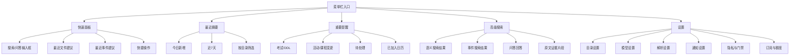
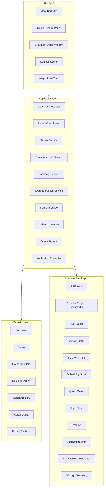
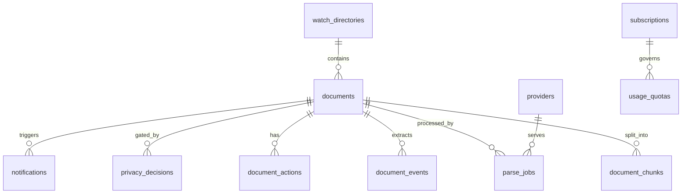

# 落知（DropKnow）信息架构图 + 技术架构图 + 数据表设计 + 前端设计

> 版本：v1.0  
> 适用阶段：MVP / Phase 1 实施前设计基线  
> 适用产品：面向大学生/研究生的 macOS 原生“下载即理解”助手

---

# 1. 文档目标

本文档用于把 **落知（DropKnow）** 的关键设计一次性固化为可开发的结构方案，覆盖：

1. 信息架构（用户能看到和操作的系统结构）
2. 技术架构（系统模块、数据流、能力边界）
3. 数据表设计（本地数据库与业务实体）
4. 前端设计（macOS 原生交互、页面分层、组件规范）

本文档服务于两个目标：

- 让产品、设计、开发对 **“做什么、不做什么”** 有一致理解
- 为后续 SwiftUI / AppKit / SQLite / 文件监听 / 模型调用实现提供直接蓝图

---

# 2. 设计原则

## 2.1 产品原则

1. **下载即理解**  
   文件不需要用户手动拖进应用；文件落地后自动进入理解链路。

2. **提醒比摘要更重要**  
   摘要只是信息压缩；真正有价值的是识别“是否重要、是否有时间、是否值得入历”。

3. **少打扰，高精准**  
   宁可少提醒，也不做低置信度的误提醒。

4. **目录授权清晰，隐私边界清晰**  
   用户明确授权目录；高敏感文件在上云前必须经过本地门禁。

5. **Mac 原生优先**  
   设计遵循菜单栏应用、浮层、Settings、快捷键、面板等 macOS 原生交互模型。

## 2.2 技术原则

1. **本地优先，云端增强**  
   文件发现、去重、索引、门禁、本地检索在本地完成；摘要和事件抽取主要由云端模型承担。

2. **解耦流水线**  
   监听、解析、门禁、摘要、事件抽取、索引、通知必须分阶段解耦，不允许做成大同步函数。

3. **先支持最核心格式**  
   MVP 只支持 PDF / DOCX（可选 TXT/MD），不支持 Excel / PPT / OCR。

4. **SQLite 单机架构优先**  
   MVP 不引入服务端数据库；本地数据以 SQLite + FTS5 为主，必要时扩展本地向量索引。

5. **UI 与系统能力分层**  
   SwiftUI 负责主要界面，AppKit 只用于系统级浮层、快捷键、菜单栏细节和窗口行为增强。

---

# 3. 功能边界（当前版本）

## 3.1 支持范围

- 监听默认下载目录（推荐 `~/Downloads`）
- 用户额外添加 1 个自定义目录（免费版限制）
- 首次静默导入最近 7 天文件
- 新文件自动解析与摘要
- 重要文件 / 事件型文件应用内提示卡片
- 高级搜索（语义搜索 + 结构化事件搜索）
- 日常问答（受额度限制）
- 高置信度事件支持加入 Apple 日历（订阅版）
- 云端模型：仅支持 Qwen + Zhipu 的受控接入

## 3.2 明确不做

- 普通文件名搜索替代 Finder / Spotlight
- Excel / PPT / 图片 OCR
- 全盘自动扫描
- 任意 OpenAI Compatible Provider 自定义接入
- 自动静默写入日历
- 多设备同步（MVP 不做）

---

# 4. 信息架构图

## 4.1 整体 IA



## 4.2 核心页面层级

### 一级入口

1. **菜单栏图标**
2. **快速面板（Launcher / Overlay）**
3. **详情窗口（Document Detail）**
4. **设置窗口（Settings）**

### 二级内容模块

#### 菜单栏下拉
- 今日新增文件
- 待处理重要提醒
- 打开快速面板
- 打开设置
- 退出

#### 快速面板
- 搜索框 / 问答框
- 最近文件
- 最近事件
- 推荐追问
- 账户额度状态

#### 详情窗口
- 文件基础信息
- 一句话摘要
- 重点卡片
- 待办/建议动作
- 事件候选
- 原文证据
- 打开原文件
- 重新解析

#### 设置窗口
- 目录与权限
- 解析偏好
- 提醒偏好
- 日历权限与默认提醒
- 账户/订阅/剩余额度

## 4.3 用户主流程

### 流程 A：新文件自动理解


### 流程 B：重要事件加入日历


### 流程 C：快速面板高级搜索/问答


---

# 5. 技术架构图

## 5.1 总体架构



## 5.2 分层说明

## UI Layer
负责：
- 菜单栏交互
- 快速搜索/问答浮层
- 详情与设置界面
- 应用内提示卡片

不负责：
- 解析逻辑
- 模型调用细节
- 数据存储细节

## Application Layer
负责：
- 编排业务流程
- 调用基础设施能力
- 管理状态、任务队列、失败重试、幂等性

## Domain Layer
负责：
- 统一业务实体
- 统一状态枚举
- 统一规则模型

## Infrastructure Layer
负责：
- 文件系统访问
- 解析实现
- 数据库存储
- 云端 API
- 日历、通知等系统 API

---

# 6. 技术模块设计

## 6.1 目录监听模块

### 职责
- 监听 Downloads 与用户授权目录
- 把文件变化事件标准化为“候选导入任务”
- 处理下载中间态、重命名完成、移动进入目录等情况

### 输入
- FSEvents / 文件枚举结果

### 输出
- `ImportTask`

### 关键规则
- 下载完成前不触发解析
- 用 `sha256 + file_size + modified_at` 去重
- 记录来源目录与授权状态

## 6.2 解析模块

### 职责
- 根据文件类型路由到 PDF / DOCX 解析器
- 产出统一文本结构

### 输出结构

```json
{
  "title": "...",
  "plain_text": "...",
  "page_count": 3,
  "parser_type": "pdfkit",
  "parse_quality": "good"
}
```

### 策略
- PDF：优先文本型 PDF
- DOCX：原生解析优先，必要时补 OOXML 自定义解析
- 不支持文件必须有明确状态码和原因

## 6.3 敏感门禁模块

### 职责
- 在上云前判断文件是否需要用户确认

### 检测输入
- 文件名
- 文件类型
- 文本前 N 行
- 敏感规则命中情况

### 输出
- `allow`
- `require_confirmation`
- `block`

## 6.4 摘要与事件抽取模块

### 摘要输出目标
- 这是什么
- 你要做什么
- 关键时间/地点
- 3 条重点

### 事件抽取输出目标
- event_type
- title
- start_time / end_time
- location
- confidence
- evidence_snippet

### 结构化输出建议

```json
{
  "document_type": "exam_notice",
  "one_line_summary": "这是大学英语期中考试安排通知。",
  "key_points": [
    "考试时间为 4 月 25 日 19:00",
    "地点在 A302",
    "需要携带学生证"
  ],
  "action_required": "按时参加考试并携带证件",
  "time_signals": [
    "2026-04-25 19:00"
  ],
  "event_candidates": [
    {
      "event_type": "exam",
      "title": "大学英语期中考试",
      "start_time": "2026-04-25T19:00:00+08:00",
      "end_time": null,
      "location": "A302",
      "confidence": 0.92,
      "evidence_snippet": "考试时间：4月25日19:00，地点：A302"
    }
  ],
  "risk_flags": []
}
```

## 6.5 搜索与问答模块

### 检索模式
1. 事件优先检索
2. 摘要/重点语义检索
3. 证据片段检索

### 搜索类型
- `semantic_search`
- `event_search`
- `qa_with_citations`

### 回答要求
- 优先返回结构化答案
- 必须带证据来源文件
- 没命中时直接承认未找到，不幻觉补全

## 6.6 日历模块

### 职责
- 处理候选事件到 Apple Calendar 的映射
- 管理“已加入日历”状态

### 注意
- 免费版不开放
- 只允许用户明确确认后写入
- 默认使用 write-only 思路实现，避免读取用户现有日历的高隐私路径

## 6.7 订阅与额度模块

### 免费版限制
- 每日文件解析 5 次
- 每日问答 5 次
- 无日历功能
- 默认目录 + 1 个自定义目录
- 高级搜索次数受限

### 订阅版能力
- 更高/无限解析额度
- 日历功能
- 更高问答额度
- 更强事件提醒能力
- 多目录扩展（后续版本）

---

# 7. 推荐工程结构

```text
DropKnow/
├─ App/
│  ├─ DropKnowApp.swift
│  ├─ AppRouter.swift
│  ├─ Scenes/
│  │  ├─ MenuBarScene/
│  │  ├─ QuickPanelScene/
│  │  ├─ DocumentDetailScene/
│  │  └─ SettingsScene/
│
├─ Features/
│  ├─ Watcher/
│  ├─ Import/
│  ├─ Parsing/
│  ├─ PrivacyGate/
│  ├─ Summarization/
│  ├─ Events/
│  ├─ Search/
│  ├─ Calendar/
│  ├─ Notifications/
│  └─ Subscription/
│
├─ Shared/
│  ├─ DesignSystem/
│  ├─ Components/
│  ├─ Utilities/
│  ├─ Extensions/
│  └─ Logging/
│
├─ Domain/
│  ├─ Entities/
│  ├─ ValueObjects/
│  ├─ Enums/
│  └─ Protocols/
│
├─ Infrastructure/
│  ├─ FileWatching/
│  ├─ Parsers/
│  ├─ Database/
│  ├─ Providers/
│  ├─ Calendar/
│  └─ System/
│
├─ Resources/
│  ├─ Assets.xcassets
│  ├─ Localizable.strings
│  └─ SampleData/
│
└─ Tests/
   ├─ UnitTests/
   ├─ IntegrationTests/
   └─ UITests/
```

---

# 8. 数据表设计

> 数据库建议：**SQLite**  
> 检索建议：**SQLite FTS5**  
> 向量方案：MVP 可先本地存 embedding 数组 / blob，Phase 2 再升级为独立向量索引。

## 8.1 表关系总览



## 8.2 核心表

## Table: `watch_directories`

记录用户授权监听的目录。

| 字段 | 类型 | 说明 |
|---|---|---|
| id | TEXT PK | 目录 ID |
| display_name | TEXT | 显示名称 |
| path_hint | TEXT | 路径提示，不作为真实授权依据 |
| bookmark_data | BLOB | security-scoped bookmark |
| is_default_downloads | INTEGER | 是否默认下载目录 |
| is_active | INTEGER | 是否启用 |
| created_at | DATETIME | 创建时间 |
| updated_at | DATETIME | 更新时间 |

## Table: `documents`

文件主表。

| 字段 | 类型 | 说明 |
|---|---|---|
| id | TEXT PK | 文件 ID |
| watch_directory_id | TEXT FK | 来源目录 |
| file_name | TEXT | 文件名 |
| file_extension | TEXT | 扩展名 |
| absolute_path | TEXT | 当前路径 |
| file_hash | TEXT | 内容 hash |
| file_size | INTEGER | 文件大小 |
| created_at_fs | DATETIME | 文件系统创建时间 |
| modified_at_fs | DATETIME | 文件系统修改时间 |
| imported_at | DATETIME | 导入时间 |
| source_type | TEXT | realtime / initial_scan / manual |
| ingest_status | TEXT | pending / parsing / gated / summarized / failed |
| parse_status | TEXT | success / partial / failed / unsupported |
| parse_quality | TEXT | good / medium / poor |
| summary_status | TEXT | pending / success / failed |
| event_status | TEXT | none / candidate / confirmed / added_to_calendar |
| privacy_status | TEXT | safe / flagged / blocked / user_allowed |
| importance_score | REAL | 重要度评分 |
| last_error_code | TEXT | 最近错误码 |
| last_error_message | TEXT | 最近错误描述 |

## Table: `document_texts`

解析后的全文/关键信息单独存储，避免主表过胖。

| 字段 | 类型 | 说明 |
|---|---|---|
| document_id | TEXT PK/FK | 文件 ID |
| extracted_title | TEXT | 提取标题 |
| plain_text | TEXT | 全文纯文本 |
| page_count | INTEGER | 页数 |
| parser_type | TEXT | pdfkit / docx_native / docx_ooxml |
| language_hint | TEXT | 语言提示 |
| text_length | INTEGER | 文本长度 |
| extracted_at | DATETIME | 提取时间 |

## Table: `document_chunks`

切片表，用于语义检索与证据展示。

| 字段 | 类型 | 说明 |
|---|---|---|
| id | TEXT PK | chunk ID |
| document_id | TEXT FK | 文件 ID |
| chunk_index | INTEGER | 切片序号 |
| content | TEXT | 切片内容 |
| content_preview | TEXT | 简短预览 |
| token_count | INTEGER | 估算 token |
| char_count | INTEGER | 字符长度 |
| page_from | INTEGER | 起始页 |
| page_to | INTEGER | 结束页 |
| embedding_blob | BLOB | 向量数据 |
| created_at | DATETIME | 创建时间 |

## Table: `document_summaries`

摘要结果。

| 字段 | 类型 | 说明 |
|---|---|---|
| document_id | TEXT PK/FK | 文件 ID |
| document_type | TEXT | exam_notice / assignment / event_notice ... |
| one_line_summary | TEXT | 一句话总结 |
| action_required | TEXT | 需要做什么 |
| key_points_json | TEXT | 重点数组 JSON |
| time_signals_json | TEXT | 时间信号数组 JSON |
| risk_flags_json | TEXT | 风险标记数组 JSON |
| confidence | REAL | 摘要整体置信度 |
| model_provider | TEXT | zhipu / qwen |
| model_name | TEXT | 模型名 |
| created_at | DATETIME | 创建时间 |
| updated_at | DATETIME | 更新时间 |

## Table: `document_events`

事件候选表。

| 字段 | 类型 | 说明 |
|---|---|---|
| id | TEXT PK | 事件候选 ID |
| document_id | TEXT FK | 来源文件 |
| event_type | TEXT | exam / ddl / activity / class_change ... |
| title | TEXT | 事件标题 |
| start_time | DATETIME | 开始时间 |
| end_time | DATETIME | 结束时间 |
| timezone | TEXT | 时区 |
| location | TEXT | 地点 |
| notes | TEXT | 备注 |
| evidence_snippet | TEXT | 证据片段 |
| confidence | REAL | 置信度 |
| decision_status | TEXT | suggested / accepted / dismissed / expired |
| calendar_status | TEXT | not_added / added / failed |
| calendar_event_identifier | TEXT | 本地记录用 |
| created_at | DATETIME | 创建时间 |
| updated_at | DATETIME | 更新时间 |

## Table: `privacy_decisions`

敏感门禁记录。

| 字段 | 类型 | 说明 |
|---|---|---|
| id | TEXT PK | 门禁记录 ID |
| document_id | TEXT FK | 文件 ID |
| risk_level | TEXT | low / medium / high |
| rule_hits_json | TEXT | 命中规则 |
| sampled_text | TEXT | 本地采样片段 |
| decision | TEXT | allow_once / deny / always_ask / trust_directory |
| decided_at | DATETIME | 决策时间 |

## Table: `notifications`

应用内提示与系统通知记录。

| 字段 | 类型 | 说明 |
|---|---|---|
| id | TEXT PK | 通知 ID |
| document_id | TEXT FK | 关联文件 |
| notification_type | TEXT | summary_card / important_card / system_notice |
| title | TEXT | 标题 |
| body | TEXT | 内容 |
| action_payload_json | TEXT | 按钮动作 |
| shown_at | DATETIME | 展示时间 |
| clicked_at | DATETIME | 点击时间 |
| dismissed_at | DATETIME | 关闭时间 |

## Table: `document_actions`

用户对文件进行过的操作。

| 字段 | 类型 | 说明 |
|---|---|---|
| id | TEXT PK | 操作 ID |
| document_id | TEXT FK | 文件 ID |
| action_type | TEXT | open_file / open_detail / reparse / add_calendar / dismiss |
| action_source | TEXT | menu_bar / card / detail / overlay |
| metadata_json | TEXT | 补充信息 |
| created_at | DATETIME | 操作时间 |

## Table: `parse_jobs`

流水线执行记录。

| 字段 | 类型 | 说明 |
|---|---|---|
| id | TEXT PK | 任务 ID |
| document_id | TEXT FK | 文件 ID |
| stage | TEXT | import / parse / gate / summary / event_extract / index |
| status | TEXT | queued / running / success / failed |
| provider_id | TEXT FK NULL | 调用的 provider |
| started_at | DATETIME | 开始时间 |
| finished_at | DATETIME | 结束时间 |
| duration_ms | INTEGER | 耗时 |
| error_code | TEXT | 错误码 |
| error_message | TEXT | 错误信息 |

## Table: `providers`

模型 provider 配置表（受控，不向普通用户暴露自填）。

| 字段 | 类型 | 说明 |
|---|---|---|
| id | TEXT PK | provider ID |
| provider_type | TEXT | zhipu / qwen |
| usage_role | TEXT | summary / embedding / qa |
| model_name | TEXT | 模型名 |
| base_url | TEXT | 接口地址 |
| is_active | INTEGER | 是否启用 |
| timeout_ms | INTEGER | 超时 |
| retry_policy_json | TEXT | 重试策略 |
| created_at | DATETIME | 创建时间 |

## Table: `subscriptions`

账户订阅状态。

| 字段 | 类型 | 说明 |
|---|---|---|
| id | TEXT PK | 订阅记录 ID |
| user_scope | TEXT | local_device_user |
| plan_type | TEXT | free / pro |
| status | TEXT | active / expired / cancelled |
| starts_at | DATETIME | 开始时间 |
| expires_at | DATETIME | 到期时间 |
| features_json | TEXT | 功能开关 |
| created_at | DATETIME | 创建时间 |
| updated_at | DATETIME | 更新时间 |

## Table: `usage_quotas`

每日额度记录。

| 字段 | 类型 | 说明 |
|---|---|---|
| id | TEXT PK | 额度记录 ID |
| quota_date | DATE | 日期 |
| parse_used | INTEGER | 已用解析次数 |
| parse_limit | INTEGER | 解析上限 |
| qa_used | INTEGER | 已用问答次数 |
| qa_limit | INTEGER | 问答上限 |
| advanced_search_used | INTEGER | 已用高级搜索次数 |
| advanced_search_limit | INTEGER | 高级搜索上限 |
| created_at | DATETIME | 创建时间 |
| updated_at | DATETIME | 更新时间 |

## 8.3 FTS 表建议

### `document_chunks_fts`
对 `document_chunks.content` 建立 FTS5 索引，用于：
- 关键词/短语搜索
- 标题命中
- 证据片段快速定位

建议索引字段：
- content
- content_preview

### `document_summaries_fts`
对摘要字段建立 FTS5 索引，用于：
- 一句话总结检索
- action_required 检索
- key_points 检索（展开后同步写入）

## 8.4 重要状态枚举建议

### `documents.ingest_status`
- `pending`
- `watch_detected`
- `queued`
- `parsing`
- `gated`
- `summarized`
- `indexed`
- `failed`

### `documents.event_status`
- `none`
- `candidate`
- `accepted`
- `added_to_calendar`
- `dismissed`

### `document_events.decision_status`
- `suggested`
- `accepted`
- `dismissed`
- `expired`

---

# 9. 前端设计

## 9.1 设计目标

前端不是做成“聊天应用套壳”，而是做成一个 **macOS 原生轻助手**。它必须同时满足：

1. 常驻但不烦人
2. 快速启动、快速关闭
3. 信息密度高但不拥挤
4. 重要信息优先于完整信息
5. 任何重要动作都能在 1~2 次点击内完成

## 9.2 场景模型（Scene Model）

建议采用：

- `MenuBarExtra`：菜单栏入口
- `WindowGroup`：详情与搜索主窗口
- `Settings`：独立设置窗口
- `NSPanel`：快速唤起面板 / 应用内浮层卡片

### 原因
- 菜单栏应用适合常驻轻入口
- 详情与设置不应挤在下拉菜单里
- 短暂浮层不适合做成普通 Window
- 后续可平滑接入全局快捷键唤起

## 9.3 前端布局结构

## A. 菜单栏下拉（轻量）

**用途：** 看状态、看最近提醒、打开更完整入口。

### 区块结构
1. 顶部状态区
   - App 名称 / 今日额度 / 同步状态
2. 最近一条重要提醒
3. 最近 3 条新文件摘要
4. 快捷操作
   - 打开快速面板
   - 打开设置
   - 退出

### 不建议放进去的内容
- 长列表搜索结果
- 长对话
- 多步设置表单

## B. 快速面板（核心交互入口）

**定位：** 类似命令面板 + 轻问答层。

### 结构
- 顶部输入框
- 模式切换标签：`搜索` / `问答`
- 推荐建议区
- 结果列表区
- 底部上下文栏（目录范围、剩余额度）

### 交互要求
- `ESC` 关闭
- `↑ ↓` 切换结果
- `Enter` 打开详情
- `Cmd + Enter` 打开原文件

## C. 文件详情窗口（内容承载中心）

建议用 3 区结构：

```text
左侧：文件列表 / 筛选
中间：摘要与原文证据
右侧：事件、动作、元信息 Inspector
```

### 中间内容顺序
1. 文件标题
2. 一句话摘要
3. 重点卡片
4. 要做什么
5. 原文证据片段
6. 重新解析 / 打开原文件

### 右侧 Inspector
- 文件来源目录
- 下载时间
- 解析状态
- 事件候选
- 加入日历按钮
- 敏感标记

## D. 设置窗口

建议采用分组式 Settings：
- General
- Directories
- Parsing
- Privacy
- Notifications
- Calendar
- Subscription
- About

## 9.4 视觉风格

## 视觉关键词
- 原生
- 克制
- 轻盈
- 信息优先
- 低饱和高对比

## 核心原则
1. 尽量使用系统字体、系统间距、系统材质
2. 不做大面积强品牌色铺底
3. 用层级、留白、分组表达重点，而不是花哨装饰
4. 重要信息用卡片层级区分，非重要信息用次级文本表达

## 颜色建议
- 主色：系统蓝 / 品牌青蓝一档
- 警告色：系统橙
- 高风险：系统红
- 成功/已加入日历：系统绿
- 背景：跟随 macOS Light / Dark Mode

## 9.5 组件设计

## 组件 1：SummaryCard

**用途：** 普通文件的摘要卡片

**字段：**
- 文件图标
- 文件名
- 一句话摘要
- 2~3 个关键点
- 打开详情按钮

## 组件 2：ImportantEventCard

**用途：** 高优先级事件型文件

**字段：**
- 事件类型标签
- 文件名
- 时间 / 地点
- 重点
- 操作按钮：
  - 加入日历
  - 查看详情
  - 忽略

## 组件 3：RiskGateSheet

**用途：** 敏感文件确认

**按钮：**
- 本次解析
- 不解析
- 始终询问
- 信任该目录

## 组件 4：QuotaBadge

**用途：** 展示免费版额度状态

**字段：**
- 今日解析：3/5
- 今日问答：1/5
- 高级搜索：2/5

## 组件 5：EvidenceSnippetList

**用途：** 展示搜索/问答证据片段

**字段：**
- 片段内容
- 来源文件
- 页码/位置
- 打开详情按钮

## 9.6 交互规范

## 普通文件提示
- 仅显示轻量卡片
- 自动消失
- 不进入系统通知中心

## 事件型文件提示
- 显示扩展卡片
- 可直接加入日历
- 用户关闭后进入“重要提醒”列表

## 敏感文件
- 不自动上传云端
- 必须先弹确认
- 若用户拒绝，则仍保留文件元信息，但不生成云端摘要

## 错误状态
必须明确区分：
- 文件不支持
- 文件解析失败
- 需用户确认敏感权限
- 模型调用失败
- 今日额度已用尽

## 9.7 快捷键设计

建议：
- `Cmd + Shift + K`：打开快速面板
- `Cmd + ,`：打开设置
- `Cmd + O`：打开原文件
- `Cmd + R`：重新解析
- `Esc`：关闭浮层/面板

双击 Control 唤起可作为 V1.5 研究项，首版不要作为唯一入口。

## 9.8 状态反馈设计

### 文件状态标签
- 待解析
- 解析中
- 需确认
- 已摘要
- 有事件
- 已入历
- 失败

### 操作反馈
- 重新解析：显示行内 loading
- 入历成功：按钮变为“已加入日历”
- 额度耗尽：展示升级 CTA，而不是静默失败

---

# 10. 首页/窗口线框建议

## 10.1 菜单栏下拉草图

```text
┌─────────────────────────────┐
│ 落知        今日解析 2/5     │
├─────────────────────────────┤
│ 重要提醒                    │
│ [考试] 大学英语期中考试      │
│ 4/25 19:00 · A302           │
├─────────────────────────────┤
│ 最近文件                    │
│ 1. 高数作业通知.pdf         │
│ 2. 课程调课说明.docx        │
│ 3. 活动报名通知.pdf         │
├─────────────────────────────┤
│ 打开快速面板                │
│ 设置                        │
│ 退出                        │
└─────────────────────────────┘
```

## 10.2 快速面板草图

```text
┌──────────────────────────────────────────┐
│ 搜索落知中的文件、考试、DDL…             │
├──────────────────────────────────────────┤
│ [搜索] [问答]                            │
├──────────────────────────────────────────┤
│ 推荐                                     │
│ - 我这周有哪些考试？                     │
│ - 上周下载的活动通知讲了什么？           │
│ - 帮我找所有截止到本周五的任务           │
├──────────────────────────────────────────┤
│ 结果 1：大学英语期中考试安排.pdf         │
│ 4/25 19:00 · A302 · 已识别考试事件       │
├──────────────────────────────────────────┤
│ 结果 2：课程调课通知.docx                │
│ 周三课程改到周五 14:00                   │
└──────────────────────────────────────────┘
```

## 10.3 详情窗口草图

```text
┌──────────────┬───────────────────────┬──────────────┐
│ 文件列表     │ 文件详情               │ Inspector    │
├──────────────┼───────────────────────┼──────────────┤
│ 今日新增     │ 大学英语期中考试安排   │ 来源：Downloads
│ 考试通知.pdf │ 这是期中考试安排通知   │ 状态：有事件   
│ 活动通知.pdf │                       │ 解析：成功     
│ 作业说明.docx│ 重点：                 │ 事件：考试     
│              │ 1. 4/25 19:00         │ 地点：A302     
│              │ 2. 地点 A302          │ [加入日历]     
│              │ 3. 携带学生证         │ [打开原文件]   
│              │                       │ [重新解析]     
└──────────────┴───────────────────────┴──────────────┘
```

---

# 11. 推荐实施顺序

## Step 1：先做原生壳
- MenuBarExtra
- Settings
- Quick Panel
- Document Detail Window

## Step 2：接监听与本地数据库
- watch_directories
- documents
- parse_jobs

## Step 3：接解析与门禁
- PDF / DOCX
- privacy gate

## Step 4：接摘要与事件抽取
- summaries
- events
- cards

## Step 5：接搜索与问答
- FTS5
- semantic retrieval
- evidence snippets

## Step 6：接订阅与额度
- quotas
- plan gating
- CTA

## Step 7：最后接日历
- 只做订阅版
- write-only 思路优先

---

# 12. 关键技术决策摘要

## 推荐决策

### 1. App 形态
**菜单栏常驻 + 快速面板 + 详情窗口 + 独立设置**

### 2. 技术栈
- SwiftUI 为主
- AppKit 补系统级浮层/快捷键/窗口行为
- SQLite + FTS5
- PDFKit + DOCX 双路解析
- Qwen / Zhipu 受控 provider

### 3. 本地数据库策略
**主表 + 文本表 + chunk 表 + 摘要表 + 事件表**，避免 documents 过胖。

### 4. UI 风格
遵循 macOS 原生结构，不做移动端卡片应用风格硬迁移。

### 5. 搜索定位
不做 Finder/Spotlight 替代，专注 **“语义+事件+证据” 高级搜索**。

---

# 13. 后续可扩展点

## Phase 1.5
- 全局快捷键唤起快速面板
- 更多事件类型模板
- 更好的 DOCX 富文本恢复

## Phase 2
- PPT 支持
- OCR
- 多目录套餐
- 更强问答
- 周报汇总 / 每日摘要

## Phase 3
- 多设备同步
- iPhone / iPad 配套客户端
- 学校/课程级主题视图

---

# 14. 结论

落知的正确产品形态不是“聊天框 + RAG”，而是一个 **macOS 原生下载理解层**：

- 入口轻：菜单栏 + 快速面板
- 主流程短：下载 -> 理解 -> 提醒 -> 处理
- 结构清：摘要、事件、证据、操作分层
- 技术稳：本地监听、本地索引、云端抽取、权限前置

如果按本文档实施，团队下一步可以直接进入：

1. 线框图细化
2. SwiftUI 场景与导航壳搭建
3. SQLite schema 落地
4. 监听/解析/摘要端到端实现

