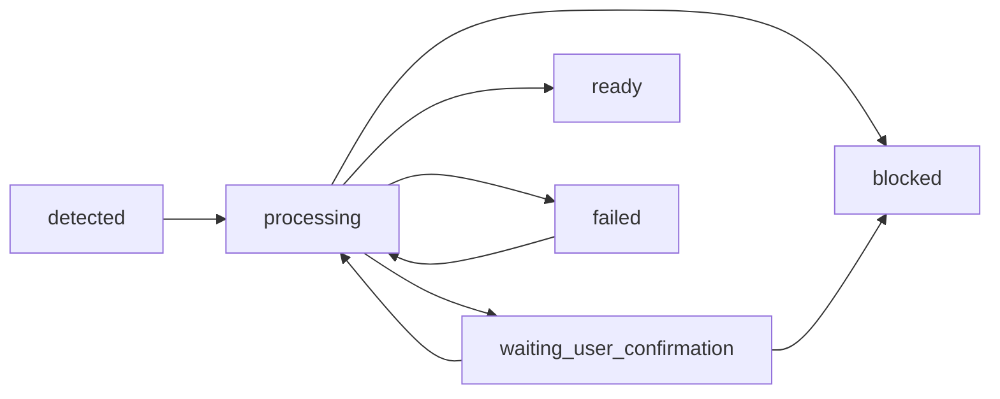

# 落知（DropKnow）状态机与错误码设计 v1.1

> 适用阶段：Phase 1 / Phase 2
> 
> 目标：统一文档生命周期、流水线阶段、事件状态、日历状态、搜索状态与错误码体系，消除状态重叠、非法组合和 UI 歧义。

---

# 1. 设计目标

本文件解决以下问题：

1. `documents` 只表达**业务级主状态**，不复写流水线执行细节。
2. `parse_jobs` 只表达**阶段级执行状态**，用于调试、重试、埋点与问题排查。
3. `document_events` 只表达**事件候选及其决策状态**。
4. 日历写入、搜索问答、配额/功能锁定单独建模，不混入通用失败状态。
5. 所有图、枚举、数据库字段、前端状态标签保持一致。

---

# 2. 状态建模原则

## 2.1 三层状态分离

## A. 文档主状态（business status）
用于表达用户视角下，这个文件当前走到了哪一步。

## B. 文档当前阶段（pipeline stage）
用于表达系统当前正在处理哪一段流水线。

## C. 任务执行状态（job execution status）
用于表达某一次阶段执行成功、失败、重试等结果。

---

# 3. 文档主状态设计

## 3.1 `documents.lifecycle_status`

建议仅保留以下枚举：

- `detected`
- `processing`
- `waiting_user_confirmation`
- `ready`
- `blocked`
- `failed`

## 3.2 含义

| 状态 | 含义 | 用户可见 | 是否可恢复 |
|---|---|---|---|
| `detected` | 已发现文件，但尚未进入完整处理 | 否/弱可见 | 是 |
| `processing` | 正在处理流水线中的某个阶段 | 是 | 是 |
| `waiting_user_confirmation` | 因敏感门禁或业务确认而暂停 | 是 | 是 |
| `ready` | 已完成可展示结果，可被搜索/查看 | 是 | 是 |
| `blocked` | 因策略/权限/功能限制而被阻断 | 是 | 视原因而定 |
| `failed` | 本轮处理失败，需重试或人工介入 | 是 | 是 |

## 3.3 状态转移图



说明：
- `ready` 不是“全部能力都完成”，而是指**已经具备对用户有价值的可展示结果**。
- `blocked` 不等于技术失败，通常是策略阻断或功能锁定。
- `failed` 是本轮执行失败，不代表文件永远不可处理。

---

# 4. 文档当前阶段设计

## 4.1 `documents.current_stage`

建议枚举：

- `import`
- `parse`
- `gate`
- `summary`
- `event_extract`
- `index`
- `notify`
- `done`

## 4.2 语义

| current_stage | 含义 |
|---|---|
| `import` | 新文件发现、稳定性检查、去重、落库 |
| `parse` | PDF / DOCX / TXT 文本提取 |
| `gate` | 敏感门禁判断与用户确认 |
| `summary` | 通知型摘要生成 |
| `event_extract` | 事件候选抽取 |
| `index` | chunk、FTS、embedding 等索引写入 |
| `notify` | 触发应用内卡片/提醒列表 |
| `done` | 本轮主链路完成 |

## 4.3 原则

- `lifecycle_status` 只表达“业务位置”。
- `current_stage` 只表达“当前走到哪一步”。
- UI 标签优先看 `lifecycle_status`，调试页和开发日志看 `current_stage`。

---

# 5. 流水线任务状态设计

## 5.1 `parse_jobs.stage`

与 `documents.current_stage` 对齐：

- `import`
- `parse`
- `gate`
- `summary`
- `event_extract`
- `index`
- `notify`

## 5.2 `parse_jobs.status`

建议枚举：

- `queued`
- `running`
- `success`
- `failed`
- `skipped`
- `cancelled`

## 5.3 含义

| status | 含义 |
|---|---|
| `queued` | 已入队，等待执行 |
| `running` | 正在执行 |
| `success` | 阶段执行成功 |
| `failed` | 阶段失败 |
| `skipped` | 被策略跳过，例如不支持类型、可忽略、无事件 |
| `cancelled` | 因用户操作或状态变化被取消 |

## 5.4 说明

- `parse_jobs` 是**执行日志**，不是文档主状态。
- 同一 `document_id` 可以有多条 `parse_jobs`。
- 重试时建议新增 job 记录，而不是原地覆盖，保留追踪历史。

---

# 6. 文档辅助状态字段

## 6.1 `documents.block_reason`

用于表达为什么进入 `blocked` 或 `waiting_user_confirmation`。

建议枚举：

- `none`
- `privacy_confirmation_required`
- `quota_exceeded`
- `feature_locked`
- `unsupported_type`
- `permission_denied`
- `policy_blocked`

## 6.2 `documents.readiness_flags`

建议在业务层维护聚合能力，而不是让 UI 推断。

可选字段：

- `has_text`
- `has_summary`
- `has_event_candidate`
- `has_search_index`
- `has_notification`

可落为 JSON，也可拆为多个布尔字段。

---

# 7. 事件状态设计

## 7.1 文档级事件聚合态：`documents.event_status`

建议仅保留聚合语义：

- `none`
- `has_candidate`
- `has_accepted_event`
- `has_calendar_event`
- `all_dismissed`

## 7.2 事件实例态：`document_events.decision_status`

建议枚举：

- `suggested`
- `accepted`
- `dismissed`
- `expired`

## 7.3 含义

| 状态 | 含义 |
|---|---|
| `suggested` | 已抽取为候选事件，但用户尚未处理 |
| `accepted` | 用户认可该事件，但未必已入历 |
| `dismissed` | 用户明确忽略 |
| `expired` | 事件已过期，不再推荐 |

## 7.4 原则

- 一个文件可对应多个事件候选。
- `documents.event_status` 是聚合结果。
- 接受/忽略/过期行为只发生在 `document_events` 行级。

---

# 8. 日历状态设计

## 8.1 `document_events.calendar_status`

建议枚举：

- `not_added`
- `adding`
- `added`
- `failed`
- `feature_locked`

## 8.2 含义

| 状态 | 含义 |
|---|---|
| `not_added` | 尚未加入日历 |
| `adding` | 正在写入 EventKit |
| `added` | 已成功写入日历 |
| `failed` | 本次写入失败 |
| `feature_locked` | 当前套餐不支持日历 |

---

# 9. 搜索 / 问答状态设计

## 9.1 `search_sessions.status`

建议枚举：

- `idle`
- `retrieving`
- `assembling`
- `answering`
- `success`
- `no_result`
- `blocked`
- `failed`

## 9.2 `search_sessions.block_reason`

建议枚举：

- `none`
- `quota_exceeded`
- `feature_locked`
- `empty_index`

---

# 10. 配额与功能锁定

## 10.1 统一原则

以下情况不应写成通用 `failed`：

- 免费版日历功能未开放
- 今日解析额度耗尽
- 今日问答额度耗尽
- 高级搜索次数耗尽

## 10.2 表达方式

- 功能不可用：`feature_locked`
- 次数耗尽：`quota_exceeded`
- 对应资源进入 `blocked`
- UI 按 block reason 渲染升级 CTA / 引导文案

---

# 11. 前端状态标签映射

## 11.1 推荐标签映射

| UI 标签 | 条件 |
|---|---|
| 待解析 | `lifecycle_status = detected` |
| 处理中 | `lifecycle_status = processing` |
| 需确认 | `lifecycle_status = waiting_user_confirmation` |
| 已摘要 | `lifecycle_status = ready AND has_summary = true` |
| 有事件 | `event_status = has_candidate OR has_accepted_event` |
| 已入历 | `event_status = has_calendar_event` |
| 已阻断 | `lifecycle_status = blocked` |
| 失败 | `lifecycle_status = failed` |

---

# 12. 推荐数据库字段调整

## 12.1 `documents`

建议字段：

- `lifecycle_status`
- `current_stage`
- `block_reason`
- `parse_status`
- `parse_quality`
- `summary_status`
- `event_status`
- `privacy_status`
- `importance_score`
- `last_error_code`
- `last_error_message`

## 12.2 `document_events`

建议字段：

- `decision_status`
- `calendar_status`
- `calendar_event_identifier`

## 12.3 `parse_jobs`

保留：

- `stage`
- `status`
- `provider_id`
- `started_at`
- `finished_at`
- `duration_ms`
- `error_code`
- `error_message`

---

# 13. 错误码体系

## 13.1 命名规范

统一使用：

`<domain>_<reason>`

例如：
- `watch_permission_denied`
- `parse_unsupported_type`
- `summary_invalid_json`
- `quota_parse_exceeded`

## 13.2 错误域划分

- `watch_*`
- `import_*`
- `parse_*`
- `gate_*`
- `summary_*`
- `event_*`
- `search_*`
- `calendar_*`
- `quota_*`
- `feature_*`
- `db_*`
- `provider_*`
- `network_*`

---

# 14. 错误码字典

## 14.1 Watch / Import

| 错误码 | 含义 | 自动重试 | 用户可见文案 |
|---|---|---|---|
| `watch_permission_denied` | 目录权限不可用 | 否 | 无法访问该目录，请重新授权。 |
| `watch_bookmark_access_failed` | bookmark 恢复失败 | 否 | 已授权目录访问失效，请重新选择目录。 |
| `import_temp_file_skipped` | 临时文件被跳过 | 是 |  |
| `import_file_missing_after_detected` | 检测后文件已不存在 | 否 | 文件已移动或删除。 |
| `import_duplicate_ignored` | 命中去重策略 | 否 |  |
| `import_file_changed_during_parse` | 解析过程中文件发生变化 | 是 | 文件仍在变化，稍后将自动重试。 |

## 14.2 Parse

| 错误码 | 含义 | 自动重试 | 用户可见文案 |
|---|---|---|---|
| `parse_unsupported_type` | 不支持的文件类型 | 否 | 当前版本暂不支持该文件类型。 |
| `parse_pdf_failed` | PDF 解析失败 | 视情况 | 无法读取该 PDF 内容。 |
| `parse_docx_failed` | DOCX 解析失败 | 视情况 | 无法读取该 Word 文档内容。 |
| `parse_empty_text` | 提取结果为空 | 否 | 未提取到可用文本内容。 |
| `parse_scanned_document_unsupported` | 扫描件/OCR未支持 | 否 | 当前版本暂不支持扫描件识别。 |

## 14.3 Gate

| 错误码 | 含义 | 自动重试 | 用户可见文案 |
|---|---|---|---|
| `gate_sensitive_confirmation_required` | 命中敏感门禁，需用户确认 | 否 | 此文件可能包含隐私信息，是否继续解析？ |
| `gate_sensitive_blocked` | 用户拒绝解析 | 否 | 此文件已按你的设置跳过解析。 |
| `gate_policy_blocked` | 命中策略阻断 | 否 | 该文件因策略限制未被处理。 |

## 14.4 Summary / Event

| 错误码 | 含义 | 自动重试 | 用户可见文案 |
|---|---|---|---|
| `summary_provider_timeout` | 摘要请求超时 | 是 | 摘要生成超时，系统将稍后重试。 |
| `summary_invalid_json` | 摘要结构化结果非法 | 一次修复后重试 | 摘要结果格式异常，正在修复。 |
| `summary_provider_auth_failed` | provider 认证失败 | 否 | 服务配置异常，请稍后再试。 |
| `summary_provider_rate_limited` | provider 限流 | 是 | 当前请求较多，系统将稍后重试。 |
| `summary_provider_service_unavailable` | provider 服务不可用 | 是 | 摘要服务暂时不可用。 |
| `event_invalid_json` | 事件抽取 JSON 非法 | 一次修复后重试 | 事件识别结果异常，正在修复。 |
| `event_no_candidate` | 未识别到事件候选 | 否 |  |
| `event_low_confidence` | 仅识别到低置信度事件 | 否 | 检测到时间信息，但暂不建议加入日历。 |

## 14.5 Search / QA

| 错误码 | 含义 | 自动重试 | 用户可见文案 |
|---|---|---|---|
| `search_quota_exceeded` | 问答/高级搜索次数耗尽 | 否 | 今日高级搜索次数已用尽。 |
| `search_feature_locked` | 当前套餐不支持该能力 | 否 | 当前套餐暂不支持此功能。 |
| `search_empty_index` | 本地尚无可用索引 | 否 | 还没有可搜索的已解析文件。 |
| `search_retrieval_failed` | 本地召回失败 | 视情况 | 暂时无法完成检索。 |
| `qa_provider_timeout` | 问答生成超时 | 是 | 问答生成超时，正在重试。 |
| `qa_invalid_json` | 问答结构化结果非法 | 一次修复后重试 | 回答结果格式异常，正在修复。 |

## 14.6 Calendar

| 错误码 | 含义 | 自动重试 | 用户可见文案 |
|---|---|---|---|
| `calendar_feature_locked` | 套餐不支持日历 | 否 | 当前套餐暂不支持加入日历。 |
| `calendar_permission_denied` | 无日历权限 | 否 | 请先允许应用访问日历。 |
| `calendar_write_failed` | 写入日历失败 | 否 | 加入日历失败，请稍后重试。 |
| `calendar_event_expired` | 事件已过期 | 否 | 该事件已过期，无法加入日历。 |

## 14.7 Quota / Feature / DB / Network

| 错误码 | 含义 | 自动重试 | 用户可见文案 |
|---|---|---|---|
| `quota_parse_exceeded` | 今日解析额度已用尽 | 否 | 今日自动解析次数已用尽。 |
| `quota_qa_exceeded` | 今日问答额度已用尽 | 否 | 今日问答次数已用尽。 |
| `quota_advanced_search_exceeded` | 今日高级搜索额度已用尽 | 否 | 今日高级搜索次数已用尽。 |
| `feature_directory_limit_reached` | 免费版目录数量已达上限 | 否 | 当前套餐监听目录数量已达上限。 |
| `db_write_failed` | 数据写入失败 | 视情况 | 本地数据写入失败。 |
| `db_read_failed` | 数据读取失败 | 视情况 | 本地数据读取失败。 |
| `index_write_failed` | FTS/索引写入失败 | 视情况 | 本地索引写入失败。 |
| `fts_query_failed` | FTS 查询失败 | 否 | 本地搜索暂时不可用。 |
| `network_offline` | 当前无网络 | 是 | 当前网络不可用，请检查网络连接。 |

---

# 15. 自动重试策略

## 15.1 可自动重试

- `summary_provider_timeout`
- `summary_provider_rate_limited`
- `summary_provider_service_unavailable`
- `qa_provider_timeout`
- `network_offline`
- `import_file_changed_during_parse`

建议策略：指数退避 + 上限 3 次。

## 15.2 先修复再重试一次

- `summary_invalid_json`
- `event_invalid_json`
- `qa_invalid_json`

建议策略：
1. 尝试 JSON repair
2. repair 成功则重试 1 次
3. 仍失败则标记 `failed`

## 15.3 不自动重试

- `watch_permission_denied`
- `watch_bookmark_access_failed`
- `parse_unsupported_type`
- `parse_scanned_document_unsupported`
- `gate_sensitive_blocked`
- `quota_parse_exceeded`
- `quota_qa_exceeded`
- `search_feature_locked`
- `calendar_feature_locked`
- `calendar_permission_denied`

---

# 16. 幂等与恢复原则

## 16.1 文档幂等

文档识别建议使用：

- `file_hash`
- `file_size`
- `modified_at_fs`

联合判定，避免重复导入。

## 16.2 阶段恢复

- 任一阶段失败，只回退到当前阶段重试。
- 不要整体清空文档结果。
- `ready` 状态下可允许“部分结果可见 + 局部失败可重试”。

例如：
- 摘要成功、事件失败：文档仍可 `ready`
- 搜索索引失败：详情可看，但搜索不可用

---

# 17. 典型状态流示例

## 17.1 正常新文件

```text
detected
-> processing(import)
-> processing(parse)
-> processing(gate)
-> processing(summary)
-> processing(event_extract)
-> processing(index)
-> processing(notify)
-> ready(done)
```

## 17.2 命中敏感门禁

```text
detected
-> processing(parse)
-> waiting_user_confirmation(gate)
-> processing(summary)
-> ready(done)
```

## 17.3 免费版额度耗尽

```text
detected
-> blocked(block_reason = quota_exceeded)
```

## 17.4 摘要成功但事件失败

```text
detected
-> processing
-> ready(has_summary = true, has_event_candidate = false)
```

---

# 18. 实施建议

## 18.1 先落数据库，再落代码枚举

顺序建议：
1. 统一本文件枚举
2. 更新 SQLite schema
3. 定义 Swift enum / DTO
4. 再接 ViewModel 与服务层

## 18.2 所有 switch 必须 exhaustive

无论是 Swift enum 还是后端状态映射：
- 不允许 default 吞状态
- 新增状态时必须显式处理 UI、日志、埋点

## 18.3 埋点字段建议

每次状态迁移记录：
- `document_id`
- `from_status`
- `to_status`
- `current_stage`
- `error_code`
- `duration_ms`
- `provider`
- `plan_type`

---

# 19. 最终推荐状态真集

## documents.lifecycle_status
- `detected`
- `processing`
- `waiting_user_confirmation`
- `ready`
- `blocked`
- `failed`

## documents.current_stage
- `import`
- `parse`
- `gate`
- `summary`
- `event_extract`
- `index`
- `notify`
- `done`

## parse_jobs.status
- `queued`
- `running`
- `success`
- `failed`
- `skipped`
- `cancelled`

## document_events.decision_status
- `suggested`
- `accepted`
- `dismissed`
- `expired`

## document_events.calendar_status
- `not_added`
- `adding`
- `added`
- `failed`
- `feature_locked`

## search_sessions.status
- `idle`
- `retrieving`
- `assembling`
- `answering`
- `success`
- `no_result`
- `blocked`
- `failed`
